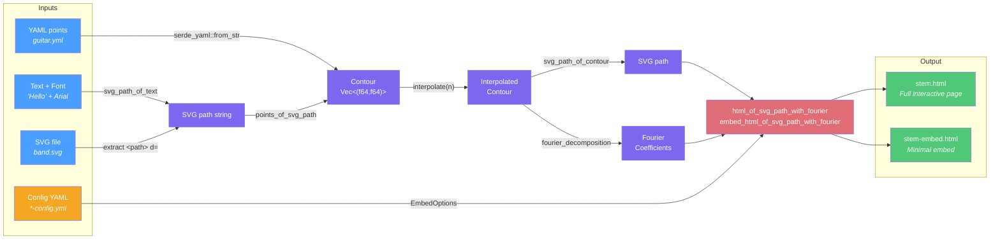

# circles-sketch

A Rust tool that reads 2D contours from YAML files, text strings, or SVG files, computes their complex Fourier decomposition, and generates interactive HTML visualizations with animated epicycles.

[](https://crates.io/crates/circles-sketch)

## Install

```bash
cargo install circles-sketch
```

## Live demos

- [Band](https://laurentcarrie.github.io/fluffy-eureka/examples/band.html)
- [Electric Guitar](https://laurentcarrie.github.io/fluffy-eureka/examples/guitar.html)
- [Music Note](https://laurentcarrie.github.io/fluffy-eureka/examples/note.html)
- [Cursive Text "Move"](https://laurentcarrie.github.io/fluffy-eureka/examples/move-the-line.html)
- [Cardioid](https://laurentcarrie.github.io/fluffy-eureka/examples/cardioid.html)
- [Square](https://laurentcarrie.github.io/fluffy-eureka/examples/square.html)

## How it works

Any closed 2D shape can be described as a sum of rotating circles (Fourier series). This tool:

1. Reads a contour from one of three input sources (YAML points, text string, SVG file)
2. Interpolates the contour to N evenly-spaced points (default 1000, configurable with `-n`)
3. Computes the complex Discrete Fourier Transform (DFT)
4. Generates two self-contained HTML files: a full interactive page and a minimal embed version

The animation shows epicycles (rotating circles) that, when chained together, trace out the original shape. As more harmonics are added, the approximation gets closer to the original contour.



## CLI

The tool uses subcommands for different input types:

### From YAML points

```bash
circles-sketch points examples/guitar.yml
open examples/guitar.html
```

Reads `guitar.yml` and the matching config `guitar-config.yml`, producing `guitar.html` and `guitar-embed.html`.

### From text

```bash
circles-sketch text --font "TimesNewRomanPSMT" "Hello World"
open hello-world.html
```

Renders text using a system font and generates the visualization. Use `list-fonts` to find available font PostScript names:

```bash
circles-sketch list-fonts
```

### From SVG

```bash
circles-sketch --flip-y svg examples/band.svg
open examples/band.html
```

Extracts `<path>` data from an SVG file. Supports absolute and relative M, L, C, Q, H, V, Z commands with bezier curve sampling. Use `--flip-y` for SVGs with negative Y scale transforms.

### Generate default config

```bash
circles-sketch init-config my-config.yml
```

### Global options

- `--config <file>` — specify a config YAML
- `-o <stem>` — set the output file stem
- `-n <N>` / `--num-points <N>` — number of interpolation points (default: 1000)
- `--flip-y` — flip Y coordinates (for SVGs with negative Y scale transforms)

## Config format

The config file controls animation behavior and display options:

```yaml
steps:
  ranges:
  - from: 1
    step: 1
    to: 10
    speed: 3.0
  - from: 10
    step: 5
    to: 20
    speed: 3.0
  - from: 20
    step: 10
    to: 100
    speed: 3.0
show_contour: Never          # Always, Never, or !OnceEvery {modulo: N, remainders: [0]}
show_point: true
show_trace: Always
trace_length: 0.5
opacity: 0.5
show_nh: true
trace_width: 1.0
contour_width: 1.0
show_fourier_circles: Always
trace_colors:
- red
- lime
- dodgerblue
- gold
- hotpink
- cyan
- orange
```

### Harmonic steps

The `steps` field controls how harmonics progress across animation loops. Each range specifies `from`, `step`, `to`, and `speed`:

- Start at `nh = first range's from`, with `increment = first range's step`
- At each loop, `nh += increment`
- When `nh >= range's to`, move to the next range
- Each range has its own animation `speed`

For example, with ranges `[(1, 1, 10, 3.0), (10, 5, 20, 3.0), (20, 10, 100, 1.0)]`:
- nh = 1, 2, 3, ..., 9 (increment 1, speed 3.0)
- nh = 10, 15 (increment 5, speed 3.0)
- nh = 20, 30, 40, ..., 90 (increment 10, speed 1.0)

The steps schedule is editable in the interactive HTML page using the format `from step to speed ; from step to speed ; ...`.

### Show modes

Fields `show_contour`, `show_trace`, and `show_fourier_circles` accept:

- `Always` — show on every loop
- `Never` — never show
- `!OnceEvery {modulo: N, remainders: [r1, r2, ...]}` — show when `loop_index % N` is in the remainders list

## Interactive controls

The generated full HTML page includes:

- **t slider** — scrub through the parametric position on the contour
- **Loop display** — current loop index and harmonic count
- **Start / Stop** — animate the drawing
- **Harmonics loop** — editable harmonic step schedule (`from step to speed ; ...`), speed is per-range
- **Contour / Trace / Circles** — select Always, Never, or Modulo (with modulo and remainders)
- **Point** — toggle the drawing position indicator
- **NH label** — toggle the harmonic count label on the SVG
- **Opacity** — trace opacity
- **Trace length** — fraction of the contour retained in the trace
- **Trace width / Contour width** — stroke widths

## YAML points format

Contour files are simple YAML with a list of `[x, y]` points:

```yaml
points:
  - [0.0, 0.0]
  - [1.0, 0.0]
  - [1.0, 1.0]
  - [0.0, 0.0]
```

## Examples

| File | Description |
|------|-------------|
| `examples/square.yml` | Simple square |
| `examples/cardioid.yml` | Cardioid curve |
| `examples/move-the-line` | "Move The Line" text (AkayaTelivigala font) |
| `examples/note.yml` | Music note symbol |
| `examples/guitar.yml` | Electric guitar |
| `examples/band.svg` | Band silhouette (SVG input) |

## Project structure

```
src/
  lib.rs          — Library crate root
  contour.rs      — Contour, ContourFunction, Fourier decomposition
  model.rs        — EmbedOptions, HarmonicSteps, WhenToShow config types
  svg.rs          — SVG path parsing, HTML generation
  text.rs         — Text-to-SVG-path using system fonts
  test.rs         — Unit tests
  bin/
    circles-sketch.rs — CLI binary (clap subcommands)
examples/
  *.yml           — Contour data files
  *-config.yml    — Config files
  *.html          — Generated full interactive pages
  *-embed.html    — Generated minimal embed pages
```

## Building

```bash
cargo build
cargo test
```

## Dependencies

- `clap` — CLI argument parsing with subcommands
- `serde` + `serde_yaml` — YAML serialization/deserialization
- `ttf-parser` — Font glyph outline extraction
- `font-kit` — System font lookup
